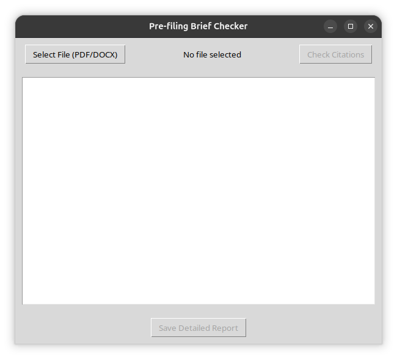
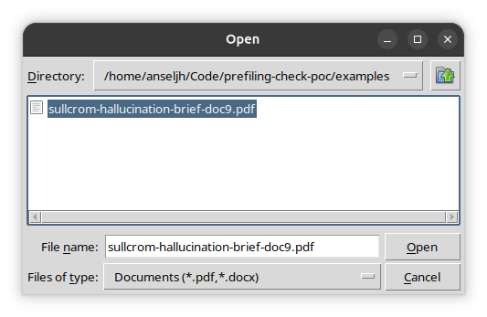
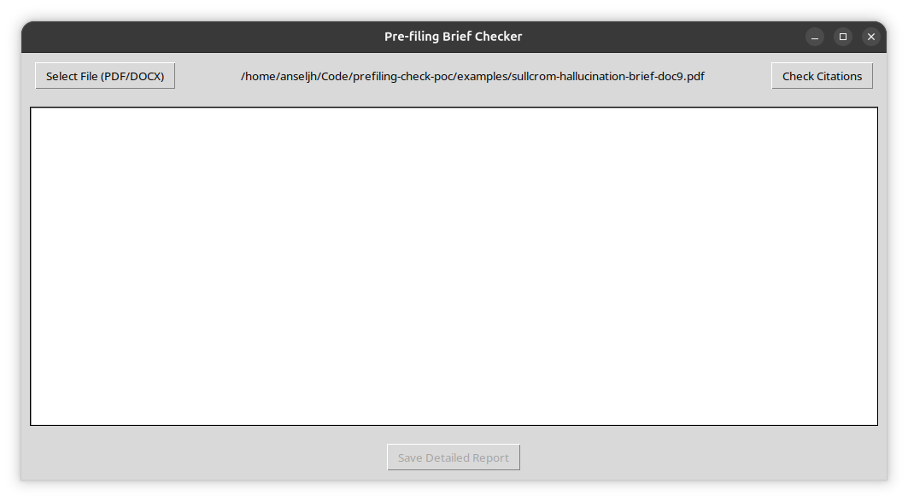
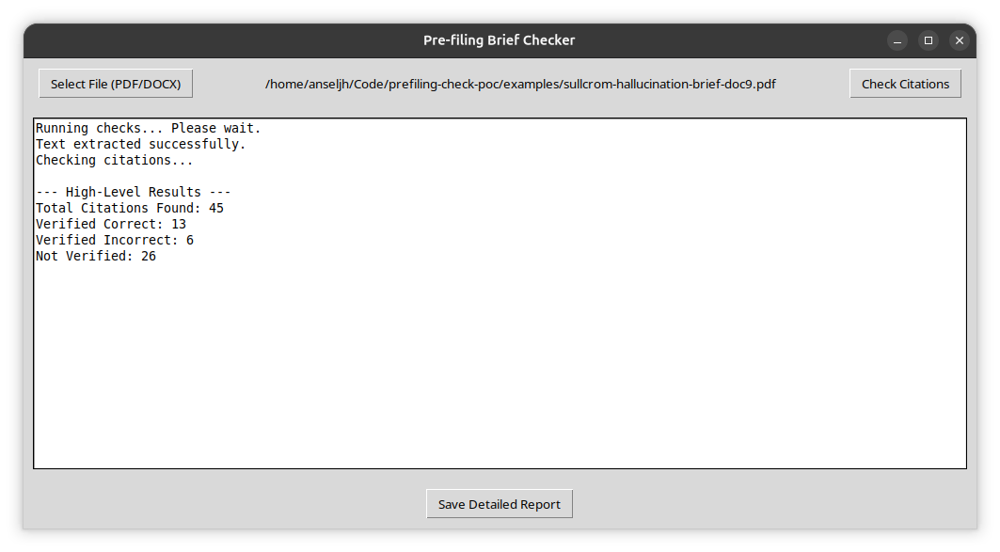
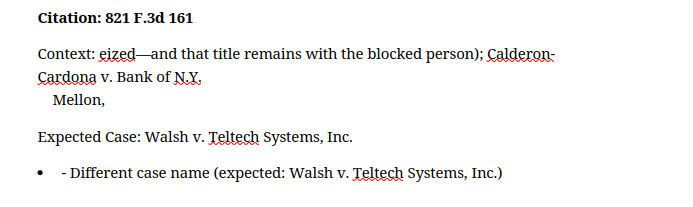

# prefiling-check-poc

Proof of concept for a pre-filing brief checker

## Purpose

Provide a simple graphical interface to select a PDF or DOCX file on the user's computer.

Run checks and show the results at a high level, and generate a more detailed report that can be saved as a PDF or DOCX file.

## Screenshots

**Main screen**



**Select file**



**Ready to check**



**Summary results**



**Bad citation example**



## Setup

### Get a CourtListener API key

Do you have a CourtListener account already? No? Why not? Go get one at <https://www.courtlistener.com/>!

Then, go to <https://www.courtlistener.com/profile/api-token/> to view your API token.

### Create your settings file

- Copy `settings-example.toml` to `settings.toml`.
- Edit `settings.toml` in your favorite text editor.
- Copy your CourtListener API token into the line that says `api_token`. Enclose it in quotations marks.
- Save the file.

### Install dependencies

- Install Python (3.14 or later) if you don't already have it.
- [Install `uv`](https://docs.astral.sh/uv/getting-started/installation/) if you don't already have it.
- Then, from a terminal in the directory where you have this package, install its Python dependencies:

```bash
uv sync
```

In the event you get a page of inscrutable errors that ends something like this:

```
    interface.cpp:2:10: fatal error: Python.h: No such file or directory
        2 | #include <Python.h>
        |          ^~~~~~~~~~
    compilation terminated.
    error: command '/usr/bin/x86_64-linux-gnu-g++' failed with exit code 1

    hint: This error likely indicates that you need to install a library that provides "Python.h" for `fast-diff-match-patch@2.1.0`
help: `fast-diff-match-patch` (v2.1.0) was included because `prefiling-check-poc` (v0.1.0) depends on `eyecite` (v2.7.6) which depends on `fast-diff-match-patch`
```

That just means you need to install some other non-Python dependencies, and then try again. On a Linux machine, try this:

```bash
sudo apt-get install python3.14-dev python3.14-tk build-essential
```

Then run `uv sync` again.

On any other operating system, you're on your own, but I believe in you! (Community PRs accepted, of course!)

## Run

```bash
uv run main.py
```

## Steps

1. Extract text from the PDF or DOCX file and save it to disk.
    - For PDFs, use Liteparse (Python package: `liteparse`)
    - For DOCX, use `python-docx` (Python package: `python-docx`)
2. Extract citations using Eyecite (Python package: `eyecite`)
3. Run checks against each extracted citation.
4. Display high-level results in the GUI:
    - Number of citations found
    - Number of citations verified as existing and facially correct
        - Citation exists
        - Court is correct
        - Year of decision is correct
        - Page range is correct
        - Name is at least partially correct (at least one word on each side of `"v."` matches, 
          or for cases without `"v."` then at least one word of the name matches, excluding "In",
          "re", "ex", "rel", and other words commonly used in case captions)
    - Number of citations that are verified to be incorrect
        - Different case name
        - Different court
        - Different year
        - Different page range
        - Different reporter/volume/page (if available in citation)
    - Number of citations not verified
        - Could not be parsed by eyecite
        - No match in CourtListener database
5. Generate a more detailed report that can be saved as a PDF or DOCX file.

## GUI Design

- File selection dialog to select a PDF or DOCX file
- "Check" button to run the checks
- Results display area to show the high-level results
- "Save Report" button to save the detailed report

## Links and Documentation

- Liteparse: https://github.com/run-llama/liteparse
- Eyecite: https://github.com/freelawproject/eyecite and https://freelawproject.github.io/eyecite/
- CourtListener API Client: https://github.com/freelawproject/courtlistener-api-client
- CourtListener citation lookup REST API: https://www.courtlistener.com/help/api/rest/citation-lookup/
